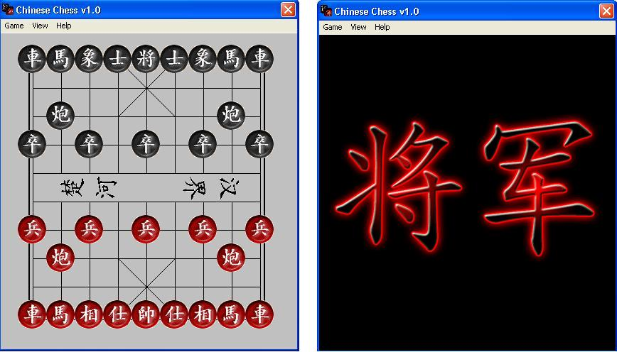



## Chinese Chess Game

### Description

This is chinese chess game which you have been looking for. 2 players allowed and it take turns to move. Nice graphic and "Checking Effect!". Please feel free to comment. Vote me if you love this coding. Thanks!
 
### More Info
 

             |
---                |---
**Submitted On**   |2006-12-03 21:57:52
**By**             |[Chia Wai Min](https://github.com/Planet-Source-Code/PSCIndex/blob/master/ByAuthor/chia-wai-min.md)
**Level**          |Advanced
**User Rating**    |5.0 (25 globes from 5 users)
**Compatibility**  |VB 3\.0, VB 4\.0 \(16\-bit\), VB 4\.0 \(32\-bit\), VB 5\.0, VB 6\.0
**Category**       |[Games](https://github.com/Planet-Source-Code/PSCIndex/blob/master/ByCategory/games__1-38.md)
**World**          |[Visual Basic](https://github.com/Planet-Source-Code/PSCIndex/blob/master/ByWorld/visual-basic.md)
**Archive File**   |[Wai\_Min\_\-\_2035151232006\.zip](https://github.com/Planet-Source-Code/chia-wai-min-chinese-chess-game__1-67273/archive/master.zip)

